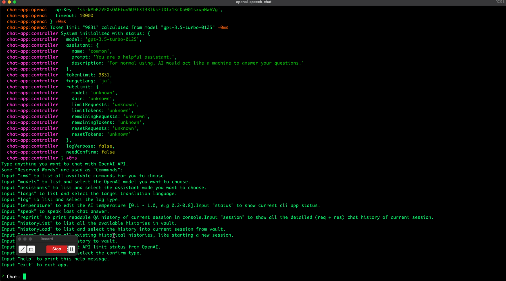
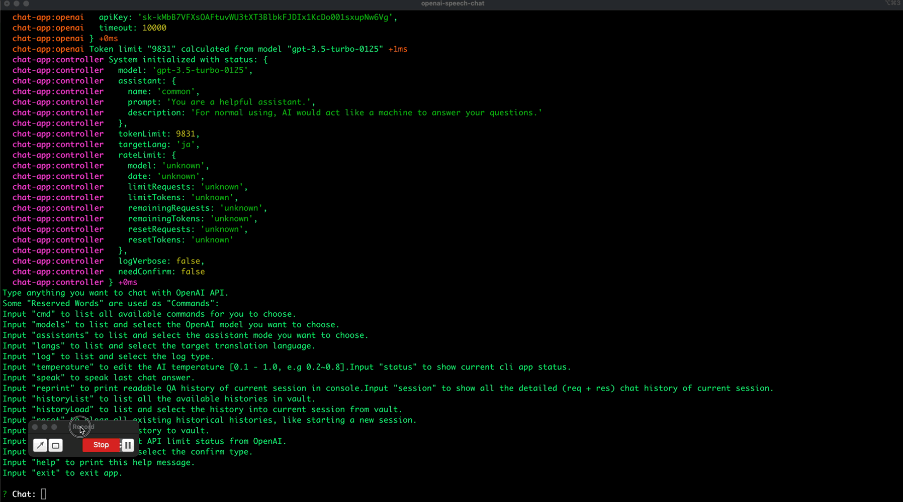
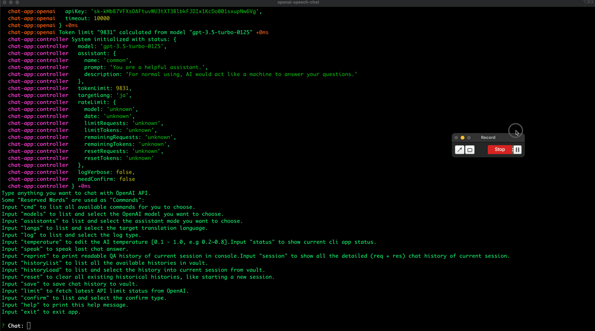
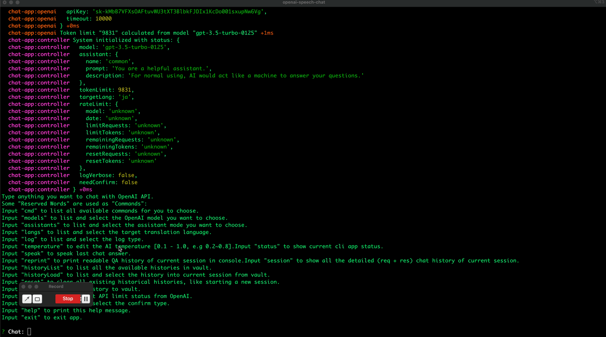
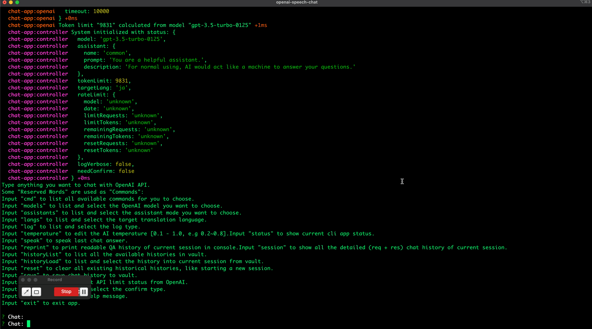
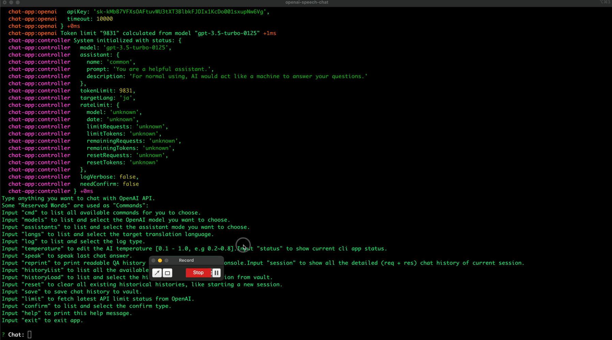

# openai-speech-chat

## Overview

Attention: 
This tool is platform restricted. Only for MAC OSX.
But if you don't want to use speech (MAC command `say`), it could be used on any platform running Node.js.

The main purpose of this project are:

- Make ChatGPT (OpenAI) easy to use
  - make it could easily been used in CLI mode
  - make it less memory occupied (no need to start a browser for it)
- I'm learning new language, I want to make it easy to ask translation questions
  - self made cli tool could let me define my own assistant with ease
- It's easy to run API with proxy: [janlay/openai-cloudflare](https://github.com/janlay/openai-cloudflare), especially useful for people behind GFW

## Config

Rename `config.yaml.example` to `config.yaml`, and edit it.

```yaml
# https://platform.openai.com/account/api-keys
apiKey: "???"

# when you call "save" command, where the sessions are saved
vaultDir: /Users/Jonathan/MEGA/OpenAI/sessions

# lower means stable response, higher means creative
temperature: 0.2
# use "baseURL: https://api.openai.com/v1" to access openai by official url
baseURL: https://YOUR_PROXY_HOST_HERE/v1
useProxy: false
proxyUrl: http://127.0.0.1:6152
maxHistory: 2500

model: gpt-3.5-turbo-0125 # default
modelTokenLimit: 16385 # default, gpt-3.5-turbo-0125
# available token count: (modelTokenLimits[x] - modelResponseMaxToken) * modelTokenThrottle
modelTokenThrottle: 0.8
modelResponseMaxToken: 4096 # official value
modelTokenLimits:
  # find the limit token count in openai docs
  # and put the limit here with model names
  # gpt-3.5 https://platform.openai.com/docs/models/gpt-3-5-turbo
  gpt-3.5-turbo-0125: 16385
  # gpt-4 https://platform.openai.com/docs/models/gpt-4-and-gpt-4-turbo
  gpt-4-0125-preview: 128000

options:
  optionsModel:
    # find all available models here: https://platform.openai.com/docs/models
    # keep an eye on the prices ...
    - gpt-3.5-turbo-0125 # $0.50 / 1M tokens
    - gpt-4-1106-preview # $10.00 / 1M tokens
    - gpt-4 # $30.00 / 1M tokens
    - gpt-4-32k # $60.00 / 1M tokens
  optionsAssistant:
    # define your own assistant here
    # the first one is the default
    - name: common
      prompt: You are a helpful assistant.
      description: For normal using, AI would act like a machine to answer your questions.
    - name: commonTranslated
      prompt: You are a helpful assistant. You will always reply questions in "{LANG}".
      description: For language learning purpose, your question would be translate to target language, then ask AI with the translated question. Means there would be 2 API calls.
    - name: commonLang
      prompt: You are a helpful assistant. You will always reply questions in "{LANG}".
      description: For normal using, AI would always reply with specified language.
    - name: translator
      prompt: You are a translator. You will be provided with a sentence, and your task is to translate it into language "{LANG}".
      description: For translation purpose, there won't be any creative response, only the translated sentence.
    - name: grammar
      prompt: You are a "{LANG}" grammar assistant. You will always help to check the grammar of the given sentence in "{LANG}".
      description: AI would help to check the grammar of the given sentence.
    - name: chat
      prompt: Act like you are real human, chatting with an old friend.
      description: For chatting purpose, AI would act like a human.
    - name: chatLang
      prompt: Act like you are real human, a native speaker of language "{LANG}", chatting with an old friend. You will always speak in "{LANG}".
      description: For chatting purpose, AI would use specified language chat with you, act like a human.
  optionsLang:
    # the first one is the default
    - ja
    - en
    - zh
langVocal:
  # see options by: say -v "?"
  zh: Meijia
  en: Samantha
  ja: Kyoko
# default value: false
# System will log detailed request and response and other verbose contents or not
logVerbose: false
# default value: false. Need to confirm input before calling OpenAI API or not
needConfirm: false
```

Items you may want to edit:

- vaultDir: choose your local position
- optionsAssistant: define your own assistants here
- optionsLang: put your target language here in options, for translation or chat
- langVocal: put language corresponding MAC voice option here

## Install & Usage

### Install

```
$ git clone https://github.com/agreatfool/openai-speech-chat.git
$ cd openai-speech-chat
$ npm install && npm run build
```

### Usage

Execute `openai-speech-chat` directly after installing and editing the config file.

Keep in mind, type `cmd` to list all available commands for controlling the cli tool.

```
 ✗ openai-speech-chat
  chat-app:config Reading config file: /Users/jonathan/Prog/Codes/NodeJs/openai-speech-chat/config.yaml +0ms
  chat-app:config Config initialized: {
  chat-app:config   apiKey: 'sk-k...g',
  chat-app:config   vaultDir: '/Users/XXX/Downloads/OpenAI',
  chat-app:config   temperature: 0.2,
  chat-app:config   baseURL: 'https://api.openai.com/v1',
  chat-app:config   useProxy: false,
  chat-app:config   proxyUrl: 'http://127.0.0.1:6152',
  chat-app:config   maxHistory: 2500,
  chat-app:config   model: 'gpt-3.5-turbo-0125',
  chat-app:config   modelTokenLimit: 16385,
  chat-app:config   modelTokenThrottle: 0.8,
  chat-app:config   modelResponseMaxToken: 4096,
  chat-app:config   modelTokenLimits: { 'gpt-3.5-turbo-0125': 16385, 'gpt-4-0125-preview': 128000 },
  chat-app:config   options: {
  chat-app:config     optionsModel: [ 'gpt-3.5-turbo-0125', 'gpt-4-0125-preview' ],
  chat-app:config     optionsAssistant: [
  chat-app:config       {
  chat-app:config         name: 'common',
  chat-app:config         prompt: 'You are a helpful assistant.',
  chat-app:config         description: 'For normal using, AI would act like a machine to answer your questions.'
  chat-app:config       },
  chat-app:config       {
  chat-app:config         name: 'commonTranslated',
  chat-app:config         prompt: 'You are a helpful assistant. You will always reply questions in "{LANG}".',
  chat-app:config         description: 'For language learning purpose, your question would be translate to target language, then ask AI with the translated question. Means there would be 2 API calls.'
  chat-app:config       },
  chat-app:config       {
  chat-app:config         name: 'commonLang',
  chat-app:config         prompt: 'You are a helpful assistant. You will always reply questions in "{LANG}".',
  chat-app:config         description: 'For normal using, AI would always reply with specified language.'
  chat-app:config       },
  chat-app:config       {
  chat-app:config         name: 'translator',
  chat-app:config         prompt: 'You are a translator. You will be provided with a sentence, and your task is to translate it into language "{LANG}".',
  chat-app:config         description: "For translation purpose, there won't be any creative response, only the translated sentence."
  chat-app:config       },
  chat-app:config       {
  chat-app:config         name: 'chat',
  chat-app:config         prompt: 'Act like you are real human, chatting with an old friend.',
  chat-app:config         description: 'For chatting purpose, AI would act like a human.'
  chat-app:config       },
  chat-app:config       {
  chat-app:config         name: 'chatLang',
  chat-app:config         prompt: 'Act like you are real human, a native speaker of language "{LANG}", chatting with an old friend. You will always speak in "{LANG}".',
  chat-app:config         description: 'For chatting purpose, AI would use specified language chat with you, act like a human.'
  chat-app:config       }
  chat-app:config     ],
  chat-app:config     optionsLang: [ 'ja', 'en', 'zh' ]
  chat-app:config   },
  chat-app:config   langVocal: { zh: 'Meijia', en: 'Samantha', ja: 'Kyoko' },
  chat-app:config   logVerbose: false,
  chat-app:config   needConfirm: false
  chat-app:config } +8ms
  chat-app:openai Init OpenAI SDK instance with: {
  chat-app:openai   baseURL: 'https://api.openai.com/v1',
  chat-app:openai   apiKey: 'sk-k...g',
  chat-app:openai   timeout: 10000
  chat-app:openai } +0ms
  chat-app:openai Token limit "9831" calculated from model "gpt-3.5-turbo-0125" +0ms
  chat-app:controller System initialized with status: {
  chat-app:controller   model: 'gpt-3.5-turbo-0125',
  chat-app:controller   assistant: {
  chat-app:controller     name: 'common',
  chat-app:controller     prompt: 'You are a helpful assistant.',
  chat-app:controller     description: 'For normal using, AI would act like a machine to answer your questions.'
  chat-app:controller   },
  chat-app:controller   tokenLimit: 9831,
  chat-app:controller   targetLang: 'ja',
  chat-app:controller   rateLimit: {
  chat-app:controller     model: 'unknown',
  chat-app:controller     date: 'unknown',
  chat-app:controller     limitRequests: 'unknown',
  chat-app:controller     limitTokens: 'unknown',
  chat-app:controller     remainingRequests: 'unknown',
  chat-app:controller     remainingTokens: 'unknown',
  chat-app:controller     resetRequests: 'unknown',
  chat-app:controller     resetTokens: 'unknown'
  chat-app:controller   },
  chat-app:controller   logVerbose: false,
  chat-app:controller   needConfirm: false
  chat-app:controller } +0ms
Type anything you want to chat with OpenAI API.
Some "Reserved Words" are used as "Commands":
Input "cmd" to list all available commands for you to choose.
Input "models" to list and select the OpenAI model you want to choose.
Input "assistants" to list and select the assistant mode you want to choose.
Input "langs" to list and select the target translation language.
Input "log" to list and select the log type.
Input "temperature" to edit the AI temperature [0.1 - 1.0, e.g 0.2~0.8].Input "status" to show current cli app status.
Input "speak" to speak last chat answer.
Input "reprint" to print readable QA history of current session in console.Input "session" to show all the detailed (req + res) chat history of current session.
Input "historyList" to list all the available histories in vault.
Input "historyLoad" to list and select the history into current session from vault.
Input "reset" to clear all existing historical histories, like starting a new session.
Input "save" to save chat history to vault.
Input "limit" to fetch latest API limit status from OpenAI.
Input "confirm" to list and select the confirm type.
Input "help" to print this help message.
Input "exit" to exit app.

? Chat:
```

## Speech Solution

I use all MAC OSX solution to do speech, rather than using some SAAS API.

- Text-to-Speech
  - MAC OSX `say` command
- Speech-to-Text
  - MAC OSX `dictation` functionality
  - This means `openai-speech-chat` will always accept text input, MAC dictation could convert the speech to text

[Apple dictation doc](https://support.apple.com/guide/mac-help/use-dictation-mh40584/mac)

## Show cases

### commonTranslated



### commonLang



### translator



### grammar



### chat



### chatLang



## ~~Google Cloud - Text-to-Speech~~

```
As google cloud API are all paid to use, I will not use them.
Now switch to MAC OSX "say" command.
```

- website: https://cloud.google.com/text-to-speech/docs
- free trial plan: https://cloud.google.com/free/docs/free-cloud-features
- billing: https://cloud.google.com/billing/docs/how-to/modify-project
- limit: https://cloud.google.com/text-to-speech/quotas
- tutorial: https://cloud.google.com/text-to-speech/docs/create-audio-text-client-libraries

Basic account

```
byte limit for each request: 5000
requests per minutes: 1000
```
